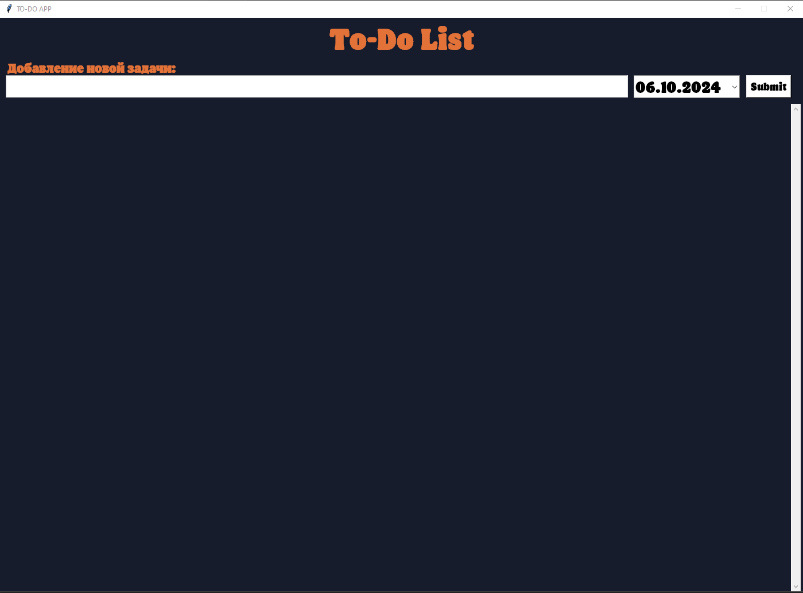
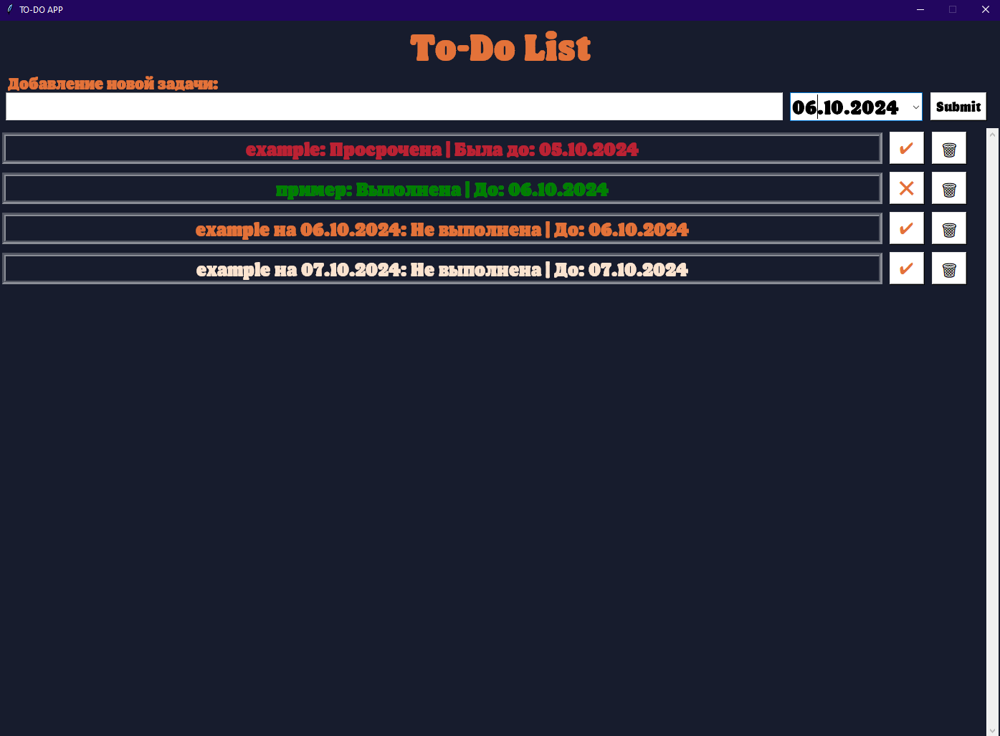
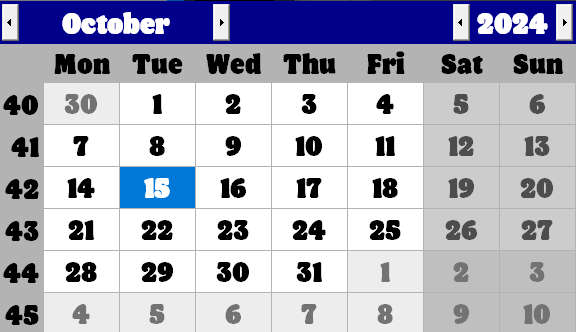

# **TO-DO App**
___
## *Описание*
TO-DO App - это простое приложение для формирования список задач на день. 
В приложении можно добавлять задачу с описанием и требуемой датой выполнения, можно отмечать статус каждой задачи (ВЫПОЛНЕНО / НЕ ВЫПОЛНЕНО) и удалять текущие задачи.
В зависимости от текущей даты, даты требуемого выполнения задачи и статуса задачи, текст окрашивается в разные цвета:
+ ***Красный цвет*** - задача просрочена, то есть её статус - Не выполнена, а дата исполнения истекла;
+ ***Оранжевый цвет*** - текущая задача, которую необходимо выполнять сегодня, то есть её статус - Не выполнена, а дата исполнения совпадает с текущей;
+ ***Блекло-розовый цвет*** - будущая задача, то есть её статус - Не выполнена, а дата исполнения впереди;
+ ***Зелёный цвет*** - задача выполнена.

____
## *Реализация*
Весь код программы представлен в виде одного файла `main.py`, в связи с его небольшим объёмом и довольно простой логикой, в которой нетрудно разобраться и отредактировать в случае необходимости.
### *Основные функции*
`initialize()`

В этой функции создаётся окно программы, задаются его параметры, а так же прописывается статичный текст.

`get_from_json()` и `write_to_json(todolist)`

С помощью данных функций осуществляется чтение и запись из файла формата в JSON, в котором сохраняются данные о всех задачах. Он нужен для того, чтобы при перезапуске программы все данные пользователя сохранялись.

`add_todo()` и `delete_todo(item)`

С помощью данных функций реализуется добавление новой задачи и удаление старых.

`complete_todo(item)`

Эта функция обеспечивает возможность изменения статуса каждой задачи.

`select_label(item, completed, due_date)`

Здесь для каждой задачи выбирается надпись, отображаемая на экране пользователя, в зависимости от её статуса выполнения и требуемой даты исполнения.

`update_label()`

Ключевая функция, с помощью которой все задачи и вспомогательные кнопки отрисовываются на экране пользователя.

### *Используемые библиотеки*
+ **tkinter**
+ **tkcalendar**
+ **json**
+ **datetime**

## *Скриншоты*

